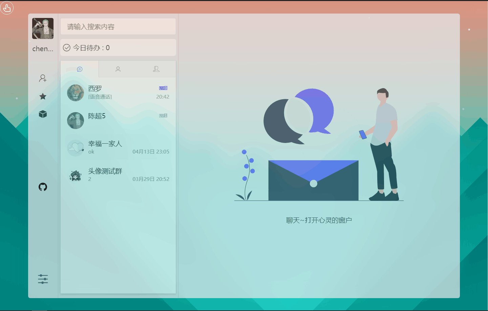
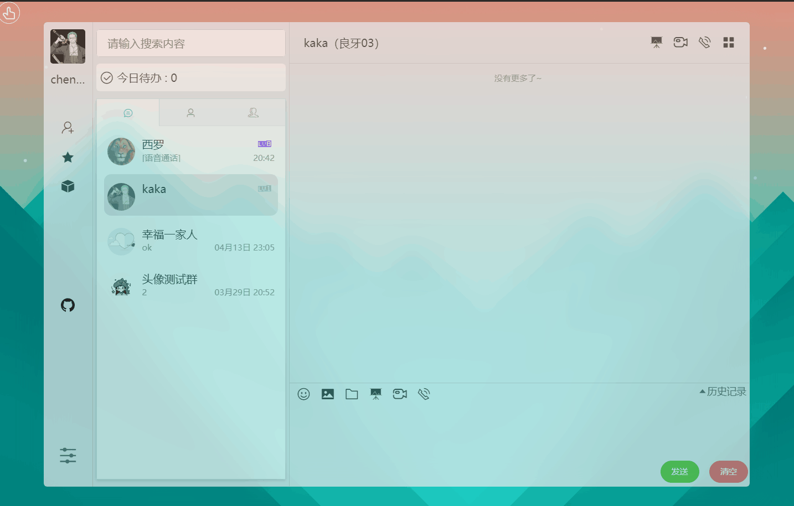
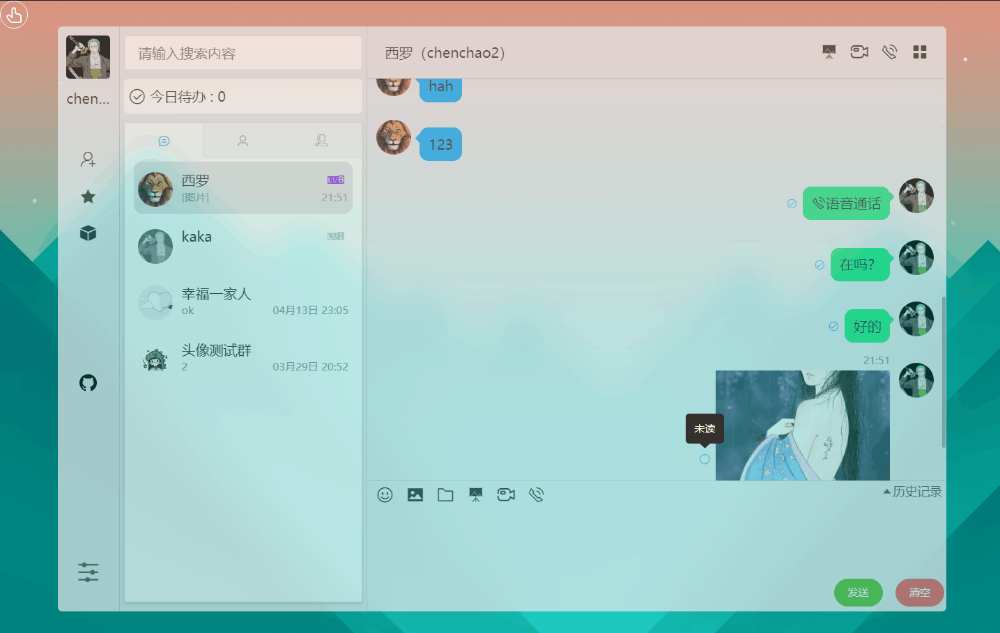
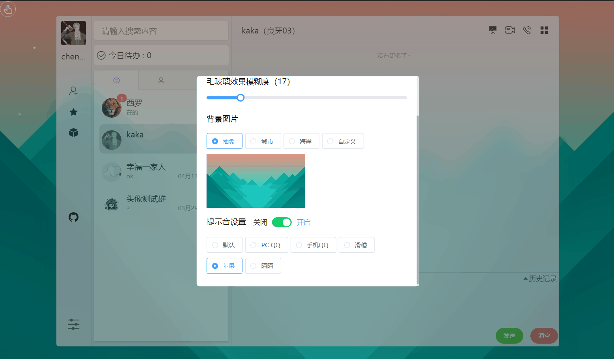

## version requirements

1. node>=12.14.0
2. npm>=6.4.1

## Function
- [x] login registration
- [x] Single Chat
- [x] group chat
- [x] History messages
- [x] Picture send
- [ ] File sending
- [ ] code snippet sent
- [x] emote send
- [x] Whiteboard collaboration
- [x] Audio and video chat
- [x] message read reminder
- [x] Friends group
- [x] Friend Notes
- [x] Reminder when friend is online
- [x] Online user avatar highlight
- [x] add friend
- [x] Add group chat
- [x] Moments function
- [x] Post Moments
- [x] circle of friends
- [x] Moments dynamic likes
- [x] Moments dynamic comments
- [x] Moments dynamic reply to comments
- [x] Schedule settings

## Summary

This system is divided into `Client`, `Server`, `Admin` three ends: `Client` is the client side, `Server` is the server side, `Admin` is the administrator side.

## project screenshot

**If there is no science on github, it is easy to crack the Internet, it is recommended to watch it on Nuggets:**

Address: https://juejin.im/post/5e8dd45cf265da47e34bf94d

### PC side

#### 1. Homepage


#### 2. Chat




#### 3. Moments


#### 4. Theme settings


#### 5. Schedule


#### 6. Personal center


### Mobile

#### 1. Login


#### 2. Chat list


#### 3. Chat interface


#### 4. Picture preview


#### 5. Skin change


#### 6. Moments


## System Function Diagram

### general user


### Admin


## Technical route

> This project is a development model with front-end and back-end separation

- The client uses `Vue`, `VueX`, `Vue-Router`, etc.;
- The administrator side uses `React`, `antd` and other technology stacks;
- The backend uses `node.js`;
- The database uses `MongoDB`;
- `WebSocket` is used for the full-duplex data communication of the chat.

## Startup project

- Clone project

`https://github.com/scartt/wechat-bot.git`

- Delete relevant code

> This part of the code is in my database, so you need to delete or replace the relevant code to prevent errors


- Start the server (port 3333)

```javascript
cd chatServer
npm install
node init.js // Initialize the database
node app.js
```

- Start the client (port 8080)
```javascript
cd chatClient
npm install
npm run dev
```

- Start the administrator (port 3000)
```javascript
cd chatAdmin
npm install
npm start
```

After the startup is complete, the streaming group can access `localhost:8080` and `localhost:3000` to access the client and administrator respectively.

## Project packaging

1. After the client code is packaged, the resources are placed in the `public` directory of the `chatServer` folder by default;
2. The administrator is in the `build` directory of `chatAdmin`, and needs to manually copy the entire build directory to the `public` directory of the `chatServer` folder, and then modify the `index.html of the `build` directory file Add `/build` before importing the resource path in `.

